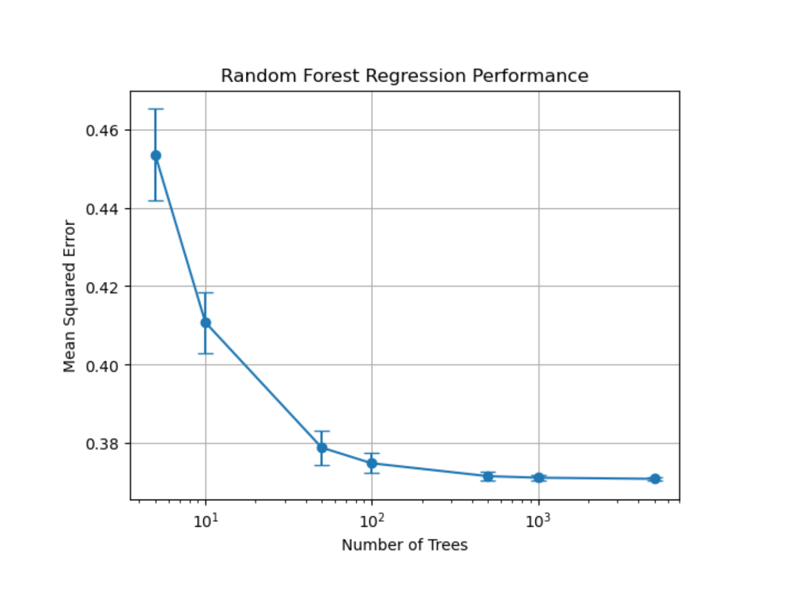

# 🍷 Python Machine Learning — Wine Quality Analysis

**Author:** Eoghan Kealy  
**Date:** December 2024  
**Project Type:** Data Science / Machine Learning  
**Tools:** Python (NumPy · Pandas · Matplotlib · Seaborn · Scikit-learn · Statsmodels)

---

## 📘 Overview
This project explores how the chemical composition of Portuguese red and white wines relates to their quality scores.  
Using the **Wine Quality Dataset** from the UCI Machine Learning Repository, the notebook performs cleaning, exploratory analysis, statistical testing, and predictive modeling to reveal the key physicochemical factors that drive wine quality.

---

## 🎯 Objectives
- Understand the data distribution and variable relationships through EDA.  
- Identify significant differences between red and white wines.  
- Build and evaluate **Linear Regression** and **Random Forest** models to predict wine quality.  
- Apply **K-Means Clustering** to group wines with similar chemical profiles.  

---

## 🧩 Dataset
**Source:** [UCI Machine Learning Repository – Wine Quality](https://archive.ics.uci.edu/ml/datasets/Wine+Quality)  
- **Red Wine Samples:** 1 599  **White Wine Samples:** 4 898  
- **Features:** 11 physicochemical variables + quality score (0–10)

---

## 🔍 Key Insights
- **Alcohol content** shows the strongest positive correlation with wine quality.  
- **Volatile acidity** is negatively correlated — higher acidity lowers quality ratings.  
- **Sulphates** and **residual sugar** contribute moderately to higher scores.  
- Random Forest Regression achieved an R² ≈ 0.47, outperforming linear models.  
- Clustering highlights distinct wine types differentiated by sugar and acidity levels.

  

  <em>Figure: Random Forest regression performance — mean squared error decreases as the number of trees increases, illustrating model optimization.</em>

---

## ⚙️ Technologies
| Category | Libraries |
|-----------|------------|
| Data Handling | pandas · numpy |
| Visualization | matplotlib · seaborn |
| Modeling | scikit-learn (RandomForest, LinearRegression) |
| Statistics | scipy · statsmodels |
| Environment | Jupyter Notebook / Python 3.9+ |

---

## 🧠 Skills Demonstrated
Data cleaning · Exploratory analysis · Statistical testing · Machine learning model building · Model evaluation · Clustering · Data visualization · Insight communication

---

## 🏁 Conclusion
This project demonstrates a complete end-to-end machine-learning workflow applied to a real-world dataset — from raw data to actionable insights.
It confirms that alcohol, acidity, and sulphate levels are the most influential predictors of perceived wine quality, showcasing both technical modeling skills and analytical interpretation.

---